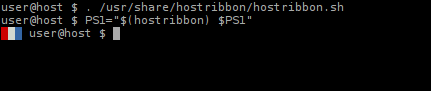

# Hostribbon - print a colorful host indentifier for your shell prompt

## Bash howto:

    . /usr/share/hostribbon/hostribbon.sh # or whereever hostribbon.sh is installed
    PS1="$(hostribbon) PS1"

## Zsh howto:

    . /usr/share/hostribbon/hostribbon.sh
    PROMPT="$(hostribbon) $PROMPT"
